# Penetration Test Report

## Anna Egbert and Preston Ford

## Self Attack

### Anna

| Item           | Result                                                                             |
| -------------- | ---------------------------------------------------------------------------------- |
| Date           | April 13, 2026                                                                     |
| Target         | pizza.afjwtpizza.click                                                             |
| Classification | Injection                                                                          |
| Severity       | 1                                                                                  |
| Description    | SQL injection attempted, database accessed                                         |
| Images         |     |
| Corrections    | Sanitize user inputs                                                               |

| Item           | Result                                              |
| -------------- | --------------------------------------------------- |
| Date           | April 13, 2026                                      |
| Target         | pizza.afjwtpizza.click                              |
| Classification | Identification and Authentication Failures          |
| Severity       | 2                                                   |
| Description    | Attacker guessed user's simple password.            |
| Images         |    |
| Corrections    | Have better passwords, limited login attempts       |

| Item           | Result                                                                                                     |
| -------------- | ---------------------------------------------------------------------------------------------------------- |
| Date           | April 13, 2026                                                                                             |
| Target         | pizza.afjwtpizza.click                                                                                     |
| Classification | Insecure Design                                                                                            |
| Severity       | 1-2                                                                                                        |
| Description    | Pizza price manipulation from customer.                                                                    |
| Images         | 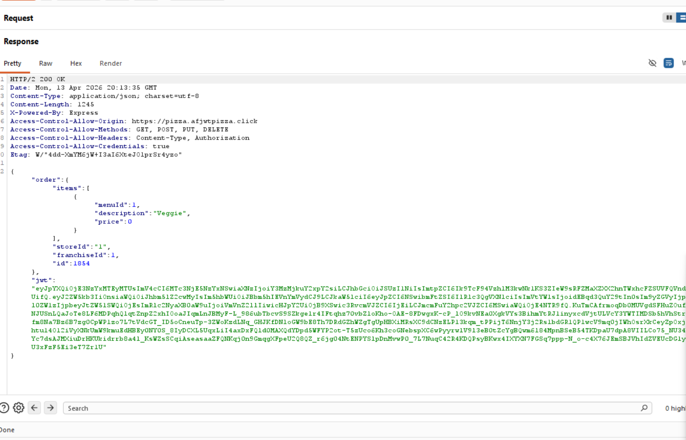   Pizza can be bought for any price, including nothing. |
| Corrections    | Change price to rely on database instead of client side                                                    |

| Item           | Result                                                                                                                                 |
| -------------- | -------------------------------------------------------------------------------------------------------------------------------------- |
| Date           | April 13, 2026                                                                                                                         |
| Target         | pizza.afjwtpizza.click                                                                                                                 |
| Classification | Identification and Authentication Failures                                                                                             |
| Severity       | 3                                                                                                                                      |
| Description    | Update user allowed active user to change their email to the same email as the admin. Admin access was obtained.                       |
| Images         |       Admin credentials obtained |
| Corrections    | Disallow duplicate emails, identify user based on id instead of name or email when updating user                                       |

| Item           | Result                                                                            |
| -------------- | --------------------------------------------------------------------------------- |
| Date           | April 13, 2026                                                                    |
| Target         | pizza.afjwtpizza.click                                                            |
| Classification | Identification and Authentication Failures                                        |
| Severity       | 1                                                                                 |
| Description    | Authtoken never expires after a login.                                            |
| Images         | 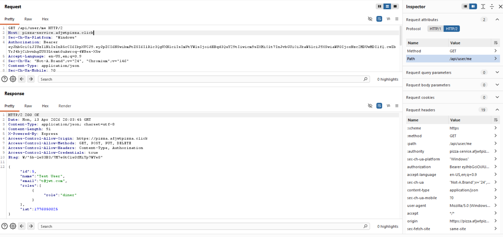    |
| Corrections    | Add authtoken expiration.                                                         |

### Preston

#### Attack 1

| Item           | Result                                                                                                                                                                                                                                                              |
| -------------- | ------------------------------------------------------------------------------------------------------------------------------------------------------------------------------------------------------------------------------------------------------------------- |
| Date           | April 12, 2026                                                                                                                                                                                                                                                      |
| Target         | pizza.pyford329.click                                                                                                                                                                                                                                               |
| Classification | Injection                                                                                                                                                                                                                                                           |
| Severity       | 0                                                                                                                                                                                                                                                                   |
| Description    | Attempted SQL injection in registering a user, using: `curl -X PUT http://localhost:3000/api/auth -H "Content-Type: application/json" -d '{"email": "e@e.com; DROP DATABASE pizza;", "password": "password"}'`. The SQL input is sanitized, so there was no effect. |
| Images         | None                                                                                                                                                                                                                                                                |
| Corrections    | None                                                                                                                                                                                                                                                                |

#### Attack 2

| Item           | Result                                                                                                                                                                                                                                          |
| -------------- | ----------------------------------------------------------------------------------------------------------------------------------------------------------------------------------------------------------------------------------------------- |
| Date           | April 12, 2026                                                                                                                                                                                                                                  |
| Target         | pizza.pyford329.click                                                                                                                                                                                                                           |
| Classification | Identification and Authentication Failures                                                                                                                                                                                                      |
| Severity       | 2                                                                                                                                                                                                                                               |
| Description    | Logic error in login authentication bypasses the password check if the provided password is a falsy value, such as an empty string. The browser prevents login attempts if the password field is empty, but this is easily bypassed using CURL. |
| Images         | 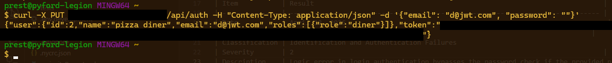   Auth token was given when password is empty.                                                                                                                                             |
| Corrections    | Fix the bug in the authentication logic.                                                                                                                                                                                                        |

#### Attack 3

| Item           | Result                                                                                                                                                                                                                                                                       |
| -------------- | ---------------------------------------------------------------------------------------------------------------------------------------------------------------------------------------------------------------------------------------------------------------------------- |
| Date           | April 12, 2026                                                                                                                                                                                                                                                               |
| Target         | pizza.pyford329.click                                                                                                                                                                                                                                                        |
| Classification | Injection                                                                                                                                                                                                                                                                    |
| Severity       | 2                                                                                                                                                                                                                                                                            |
| Description    | Inputs not sanitized when updating user information. Allows for SQL injection which can write sensitive data of another user into your username.                                                                                                                             |
| Images         | 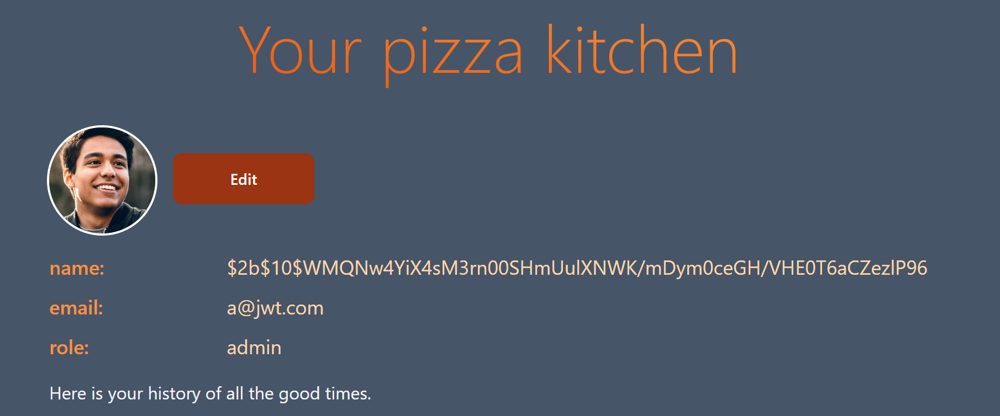   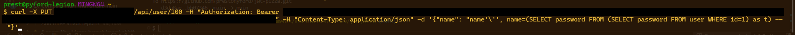   This user used a SQL injection attack to overwrite their username to be another user's password hash. The victim's hashed password is then visible in the attacker's profile page. |
| Corrections    | Sanitize inputs.                                                                                                                                                                                                                                                             |

#### Attack 4

| Item           | Result                                                                                                                           |
| -------------- | -------------------------------------------------------------------------------------------------------------------------------- |
| Date           | April 12, 2026                                                                                                                   |
| Target         | pizza.pyford329.click                                                                                                            |
| Classification | Injection                                                                                                                        |
| Severity       | 0                                                                                                                                |
| Description    | Attempted a XSS attack to run JavaScript in an admin's browser. Did not work, React escapes the HTML.                            |
| Images         | 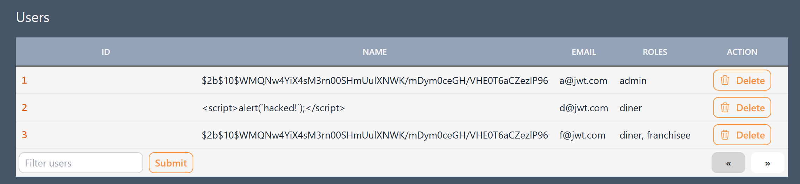   Attacker attempted XSS attack by making their username an HTML script tag with malicious code. |
| Corrections    | None                                                                                                                             |

#### Attack 5

| Item           | Result                                                                                                  |
| -------------- | ------------------------------------------------------------------------------------------------------- |
| Date           | April 12, 2026                                                                                          |
| Target         | pizza.pyford329.click                                                                                   |
| Classification | Insecure Design                                                                                         |
| Severity       | 5                                                                                                       |
| Description    | Chaos testing endpoint was left in and is present in production. Causes orders to fail 50% of the time. |
| Images         | 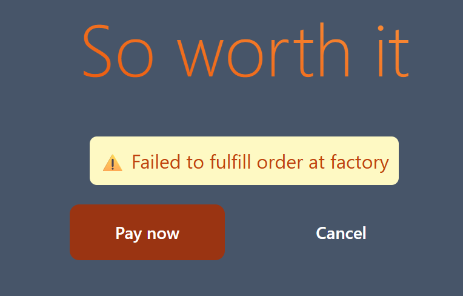   Order failed after attacker hit the chaos testing endpoint.  |
| Corrections    | Remove the chaos testing endpoint.                                                                      |

## Peer Attack

### Anna on Preston

| Item           | Result                                                 |
| -------------- | ------------------------------------------------------ |
| Date           | April 14, 2026                                         |
| Target         | pizza.pyford329.click                                  |
| Classification | Identification and Authentication Failures             |
| Severity       | 3                                                      |
| Description    | Attacker guessed admin's simple password.              |
| Images         | 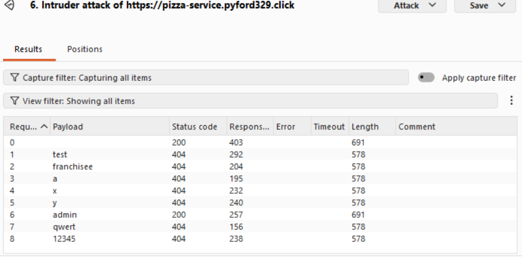   |
| Corrections    | Have better passwords, limited login attempts          |

| Item           | Result                                                                              |
| -------------- | ----------------------------------------------------------------------------------- |
| Date           | April 14, 2026                                                                      |
| Target         | pizza.pyford329.click                                                               |
| Classification | Injection                                                                           |
| Severity       | 1                                                                                   |
| Description    | SQL injection attempted, database accessed, every user's name changed               |
| Images         | 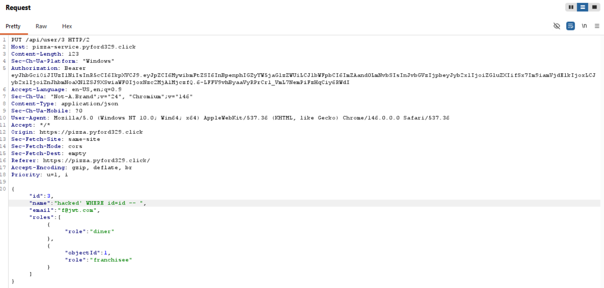   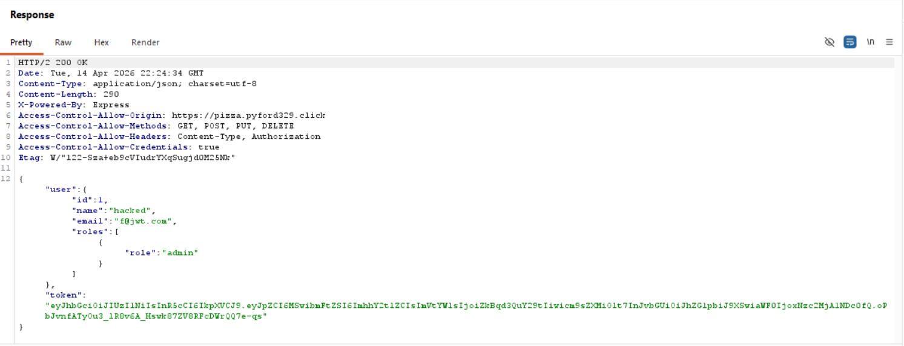 |
| Corrections    | Sanitize user inputs                                                                |

| Item           | Result                                                                                                           |
| -------------- | ---------------------------------------------------------------------------------------------------------------- |
| Date           | April 14, 2026                                                                                                   |
| Target         | pizza.pyford329.click                                                                                            |
| Classification | Identification and Authentication Failures                                                                       |
| Severity       | 3                                                                                                                |
| Description    | Update user allowed active user to change their email to the same email as the admin. Admin access was obtained. |
| Images         |            |
| Corrections    | Disallow duplicate emails, identify user based on id instead of name or email when updating user                 |

| Item           | Result                                                                                         |
| -------------- | ---------------------------------------------------------------------------------------------- |
| Date           | April 14, 2026                                                                                 |
| Target         | pizza.pyford329.click                                                                          |
| Classification | Insecure Design                                                                                |
| Severity       | 1-2                                                                                            |
| Description    | Pizza price manipulation from customer.                                                        |
| Images         |    Pizza price can be changed by customer |
| Corrections    | Change price to rely on database value only                                                    |

| Item           | Result                                                               |
| -------------- | -------------------------------------------------------------------- |
| Date           | April 14, 2026                                                       |
| Target         | pizza.pyford329.click                                                |
| Classification | Security Misconfiguration                                            |
| Severity       | 0                                                                    |
| Description    | Stack trace is presented to every user, exposing backend information |
| Images         | 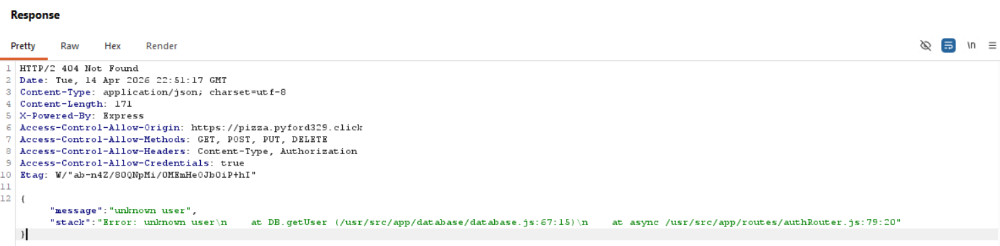                    |
| Corrections    | Only allow stack trace to website developers, not in production      |

### Preston on Anna

#### Attack 1

| Item           | Result                                                                                                                                                                                  |
| -------------- | --------------------------------------------------------------------------------------------------------------------------------------------------------------------------------------- |
| Date           | April 14, 2026                                                                                                                                                                          |
| Target         | pizza.afjwtpizza.click                                                                                                                                                                  |
| Classification | Insecure Design                                                                                                                                                                         |
| Severity       | 0                                                                                                                                                                                       |
| Description    | Attempted to overload the server with bad login requests to brute force different combinations of passwords, however precautions were made to prevent too many authentication attempts. |
| Images         | 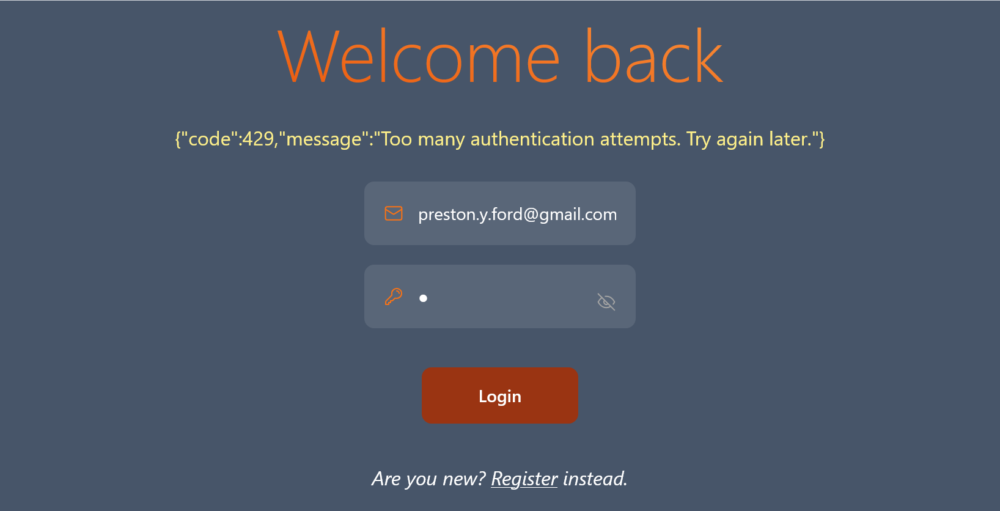                                                                                                                                                      |
| Corrections    | None                                                                                                                                                                                    |

#### Attack 2

| Item           | Result                                                                                                                                                                                                                                                                                                                                                                                                                                         |
| -------------- | ---------------------------------------------------------------------------------------------------------------------------------------------------------------------------------------------------------------------------------------------------------------------------------------------------------------------------------------------------------------------------------------------------------------------------------------------- |
| Date           | April 14, 2026                                                                                                                                                                                                                                                                                                                                                                                                                                 |
| Target         | pizza.afjwtpizza.click                                                                                                                                                                                                                                                                                                                                                                                                                         |
| Classification | Security Misconfiguration                                                                                                                                                                                                                                                                                                                                                                                                                      |
| Severity       | 1                                                                                                                                                                                                                                                                                                                                                                                                                                              |
| Description    | Production code is built with sourcemaps, allowing end users to see source code with comments. This makes it easier for attackers to find vulnerabilities by investigating the code to discover API structure and internal business logic. For example, the source code of certain components could be investigated to find XSS vulnerabilities. It could also reveal feature flags, API keys left in by mistake, and reveal proprietary code. |
| Images         | 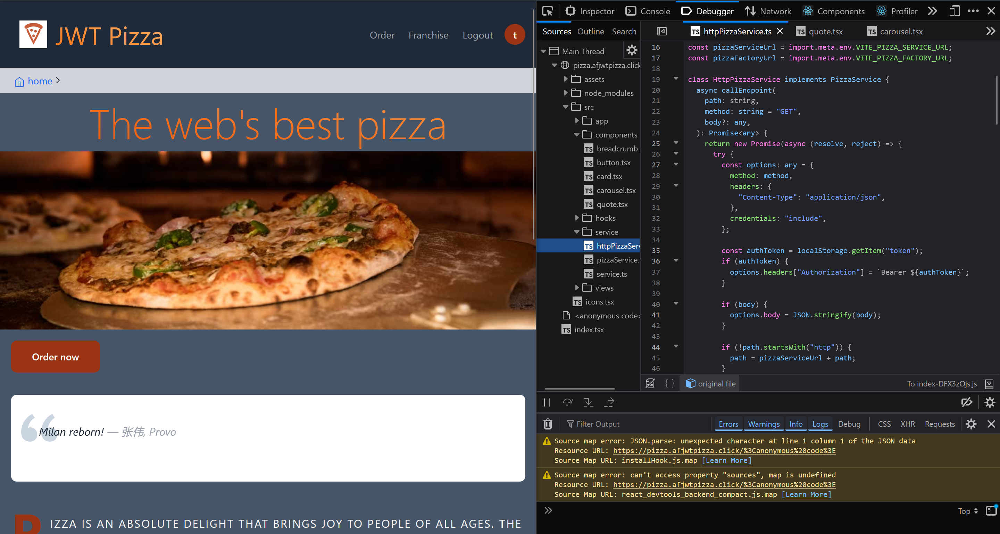                                                                                                                                                                                                                                                                                                                                                                                                                  |
| Corrections    | Build code without sourcemaps                                                                                                                                                                                                                                                                                                                                                                                                                  |

#### Attack 3

| Item           | Result                                                                                                                                                                                                          |
| -------------- | --------------------------------------------------------------------------------------------------------------------------------------------------------------------------------------------------------------- |
| Date           | April 14, 2026                                                                                                                                                                                                  |
| Target         | pizza.afjwtpizza.click                                                                                                                                                                                          |
| Classification | Security Misconfiguration                                                                                                                                                                                       |
| Severity       | 0                                                                                                                                                                                                               |
| Description    | Pizza ordering sends the price with the request. I thought this could be used to purchase a jwt pizza at a different price than is listed, however the backend does not actually use this field in the request. |
| Images         | None                                                                                                                                                                                                            |
| Corrections    | None                                                                                                                                                                                                            |

#### Attack 4

| Item           | Result                                                                                                                                                                                                 |
| -------------- | ------------------------------------------------------------------------------------------------------------------------------------------------------------------------------------------------------ |
| Date           | April 14, 2026                                                                                                                                                                                         |
| Target         | pizza.afjwtpizza.click                                                                                                                                                                                 |
| Classification | Broken Access Control                                                                                                                                                                                  |
| Severity       | 0                                                                                                                                                                                                      |
| Description    | Attempted to hit the user list endpoint as a non-admin, however access was blocked. If it was not blocked, sensitive information about other users registered with JWT Pizza could have been obtained. |
| Images         | None                                                                                                                                                                                                   |
| Corrections    | None                                                                                                                                                                                                   |

#### Attack 5

| Item           | Result                                                                                                                                                                                                                                                                                                                                             |
| -------------- | -------------------------------------------------------------------------------------------------------------------------------------------------------------------------------------------------------------------------------------------------------------------------------------------------------------------------------------------------- |
| Date           | April 14, 2026                                                                                                                                                                                                                                                                                                                                     |
| Target         | pizza.afjwtpizza.click                                                                                                                                                                                                                                                                                                                             |
| Classification | Injection                                                                                                                                                                                                                                                                                                                                          |
| Severity       | 0                                                                                                                                                                                                                                                                                                                                                  |
| Description    | Attempted to put a SQL injection to obtain other user information or to drop the database, but the queries are sanitized and the attempts did not work. `curl 'https://pizza-service.afjwtpizza.click/api/auth'-X POST -H 'Content-Type: application/json' --data-raw '{"name":"DROP DATABASE pizza;","email":"test@test.com","password":"test"}'` |
| Images         | None                                                                                                                                                                                                                                                                                                                                               |
| Corrections    | None                                                                                                                                                                                                                                                                                                                                               |

## Summary of Learnings

From our pentests we discovered that systems are most vulnerable where they accept user input. It is important to never trust the client to send accurate information, and to validate at every step. We learned that there are a variety of ways to attack a software system, such as SQL injection, DoS attacks, and brute force credential attacks. These attacks can vary in severity, from performance risks to stolen credentials.

It’s also important to not have a default configuration, especially one that’s visible, because that can leave important credentials open for exploitation. Keep as little about your software visible as possible, because more visibility means more possible attack surface. Have user roles and abilities locked down and operating within strict guidelines.

We also learned that some bugs in code may only be found when conducting penetration testing despite multiple previous rounds of different kinds of tests, showing that penetration testing is an essential part of developing safe, secure software. Some problems are only found when thinking like an attacker.
